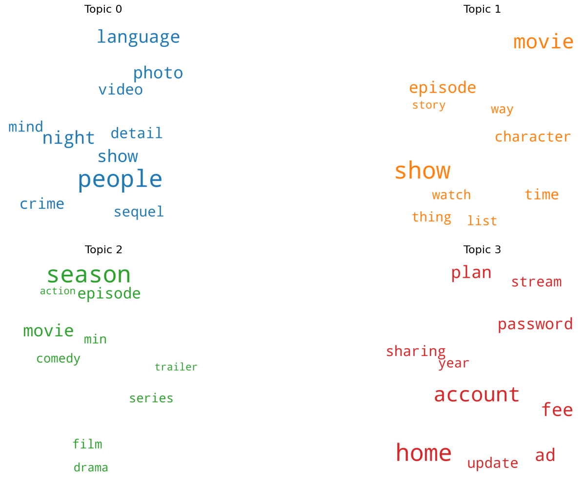
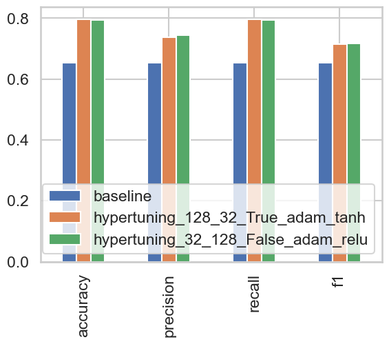

# Stock-Prediction-with Deep Learning and Reinforcement Learning
Forecasting the price movement of Stock (use case NFLX) using deep learning and reinforcement learning techniques. Also includes topical analysis of social media and news data, to see influence, if any on price movement. 
<candle stick>

## Objectives

- Build a Neural network classifier algorithm to forecast daily price movements of the NFLX stock ticker and evaluate its performance. 
-- Scrape social media data related to of NFLX, perform topical analysis, and use as a feature for the model if applicable. 
- Build a Reinforcement-learning model that will trade on NFLX stock and compensate for the shortcomings of the above. 

## Neutral Network Classifier

Predicting the stock movement is a time-series problem. The target is the forecasted relative change of the *Close* price of the stock (i.e. difference/previous value). The following features were considered as inputs into the model:
1. Financial indicators:

    i. Daily trade volume.

    ii. EPS - Earnings per share

    iii. Period in the quarter-to-quarter cycle

    iv. The SPX 500 equity index
2. Non financial indicators:

    i. Social Media (trending topics and sentiment analysis) 

    ii. Netflix Top 10 trending clusters (unsupervised learning with KMeans clustering)

### Feature Engineering
Financial data was downloaded from several financial websites. The Top 10 Netflix [dataset](https://www.kaggle.com/datasets/dhruvildave/netflix-top-10-tv-shows-and-films) up to August 2022 was got from Kaggle. I populated the rest of the dataset through web scraping. Gathering social media data was non-trivial and involved scraping the Reddit.com API for posts and comments from the [Netflix subreddit](https://www.reddit.com/r/netflix/). This data was cleaned and then used to build the corpus of a Gensim-based LDA model. The cleaned data was analyzed and sorted into 4 topics. 

However statistical analysis showed that this feature was statistically insignificant in predicting the price movement of NFLX.

Similarly the EPS and Days from last Quarter end were also discovered to have no effect on the price movement and were dropped. The final version of the model only had the following inputs: the *Volume* of trade, and its *Close* price history over a window of 3 days. Similarly, the *SPX* price history over the same window of 3 days.

There are 3 output labels:
1. No significant change (between -2% and 2%)
2. A positive change (bullish bukk🐂) of above 2%
3. A negative change (bearish🐻) of below 2%

### Results

The process of developing an appropriate deep learning model involved building and testing models of increasing complexity. From a simple one-hidden layer Dense network, to a 3-layer LSTM NN with drop-out layers. A final model, with LSTM and CNN layers were chosen, and vigorous hyper parameter tuning was performed to select the best performance. Two configurations were discovered to give the best results:

* 'hypertuning_32_128_False_adam_relu': - 128 LSTM nodes, Batch size 32, No CNN layer, 'Adam' optimizer, 'Relu' activation in the LSTM layer.
* 'hypertuning_128_32_True_adam_tanh': - 32 LSTM nodes, Batch size 128, 1 CNN layer, 'Adam' optimizer, 'Tanh' Activation

### Observations
They both beat the Naive, next-day-prediction baseline performance.
However the unbalanced classes of the output classes shows that the model's performance is not particularly impressive. 

## Reinforcement Learning

I tried to imitate the functionality of the OpenGym API. Like most reinforcement learning models, it is based on the Markov Decision Process

1. S set of states in environment E. For this problem, the Environment is the price history of the NFLX ticker. The state space is defined by the *Cash Balance*, *Price of NFLX shares*, *Number of NFLX shares owned*. 
2. A set of actions available to the agent. In this case, 3 discrete actions of **0** Hold, **1** Buy, **2** Sell.
3. Ra (s, s') - reward received for transitioning from state s to state'. The reward schedule is the profit made in each step i.e. the *current_portfolio_balance* - *previous_portfolio_balance*.
4. P_a (S, S') = P(S[T+1] = S'|S[T] = S, A[T] = A), the probability that action a in state s at time t will lead to state s' at time t+1. An LSTM NN model is trained to find the best policy (pi) that maximizes the rewards of the action/state pairs. 

In both the training and test modes, the agent iterates through the price history to complete one episode. In training mode, the model is trained, using the action/space pairs of the agent as the input and the resulting rewards as outcome. During testing, the model's weights are frozen and the agent's performances are observed.

### Results
By defaut, each episode starts with a cash balance of 1000 cash units. The training was done over 3000 epochs. The testing was done for 1000 epochs. The average portfolio balances at the end of each episode is shown below.

(*Note the logarithmic scale? Now imagine if that was real money!*)

Further studies will be required to explore this.

## Deployment

The classifier model broadcasts its results at the end of US market day via flask-based app running on an AWS EC2 instance. 

## Conclusion
The project was an interesting experience. It highlighted how much effort is put into feature engineering only to discover that the information is of no current value to the present model. It also highlighted the challenges of time-series prediction. The most significant finding was realizing the restrictions of supervised learning models: regardless of how sophisticated the architecture of the algorithm, it can never be better than the features which were put into it in the first place. This was where reinforcement learning excels, in allowing the algorithm to discover patterns and strategies without restriction. The potential for this type of learning is exciting.

### Future Work
- Develop the model to trade across a multi-stock platform. Deploy in real-time (for personal use only!) 