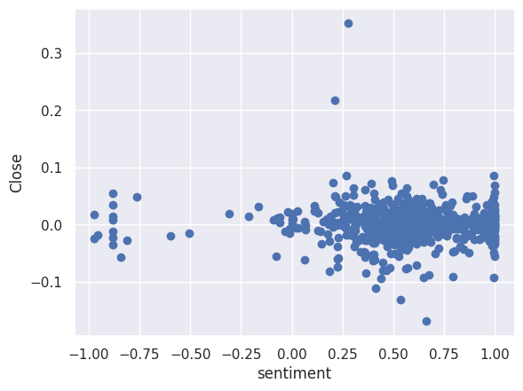
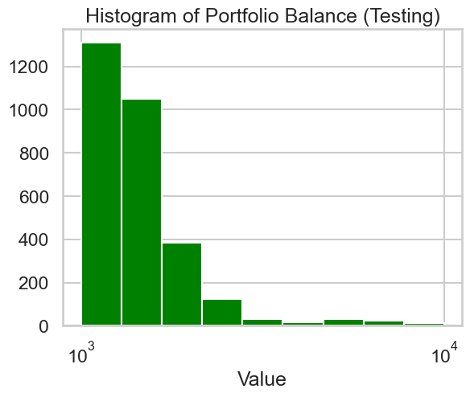

# Stock-Prediction-with Deep Learning and Reinforcement Learning
Forecasting the trend and price of Stock (use case NFLX) using deep learning and reinforcement learning techniques. Also involves sentiment analysis of social media and news data, to see influence, if any on price movement. 
<candle stick>

## Objective

- To build a model that can forecast the daily movement of the NFLX stock ticker.
- To scrap social media and news around this stock, perform sentiment analysis of the findings, and if applicable, incorporate this as a feature of the model.
- To build a reinforcement-learning model that will close the shortcomings of the above. 

## Deep Learning Classifier

Predicting the stock movement is a time-series probkem. The target is the relative change of the *Close* price (i.e. difference/previous value). The following features were considered as inputs into the model:
1. Social Media 
2. Volume of trade.
3. EPS - Earnings per share
4. Days from the last Quarter end
5. The SPX 500 equity index

### Feature Engineering
Gathering data on NFLX was non-trivial and involved scraping the Reddit.com API for posts and comments from the [Netflix subreddit](https://www.reddit.com/r/netflix/). This data was cleaned and then used to build the corpus of a Gensim-based LDA model. The cleaned data was analyzed and sorted into 4 topics.

However statistical analysis showed that this feature was statistically insignificant in predicting the price movement of NFLX.

Similarly the EPS and Days from last Quarter end were also discovered to have no effect on the price movement and were dropped. The final version of the model only had the following inputs: the *Volume* of trade, and its *Close* price history over a window of 3 days. Similarly, the *SPX* price history over the same window of 3 days.

The model was predicting one of 3 possible outcomes:
1. No significant change (between -2% and 2%)
2. A positive change (bullish) of above 2%
3. A negative change (bearish) of below 2%

### Results
!plot[images/clf_results.png]
The process of developing an appropriate deep learning model involved building and testing models of increasing complexity. From a simple one-hidden layer Dense network, to a 3-layer LSTM NN with drop-out layers. A final model, with LSTM and CNN layers were chosen, and vigorous hyper parameter tuning was performed to select the best performance. Two configurations were discovered to give the best results:

<image of model configuration>

* 'hypertuning_32_128_False_adam_relu': - 128 LSTM nodes, Batch size 32, No CNN layer, 'Adam' optimizer, 'Relu' activation in the LSTM layer.
* 'hypertuning_128_32_True_adam_tanh': - 32 LSTM nodes, Batch size 128, 1 CNN layer, 'Adam' optimizer, 'Tanh' Activation

### Observations
They both beat the Naive, next-day-prediction baseline performance.
However the unbalanced classes of the output classes shows that the model's performance is not particularly impressive. 

## Reinforcement Learning

The Markov Decision Process is the basis of most reinforcement learning models, including this one:
1. S set of states in environment E
2. A set of actions available to the agent
3. P_a (S, S') = P(S[T+1] = S'|S[T] = S, A[T] = A), the probability that action a in state s at time t will lead to state s' at time t+1
4. Ra (s, s') - reward received for transitioning from state s to state'.

Optimization problem: find the best (pi) that maximizes rewards of the action/state pairs. 

I tried to imitate the functionality of the OpenGym API. The price history of the NFLX ticker is the Learning Environment. The model is the agent and its policy is to maximize profit from buying and selling stock. The reward function is the difference between an initial cash position and the value of the final position.

Action Space: Discrete(3): **0** Hold, **1** Buy, **2** Sell
State Space: *Cash Balance*, *Price of NFLX shares*, *Number of NFLX shares owned* 
Reward Schedule: Current portfolio value - initial portfolio value at the end of each step.

In both the training and test modes, the agent iterates through the set of available data to complete one episode. In training mode, the LSTM model is trained, using the action/space pairs of the agent as the input and the resulting rewards as outcome. During testing, the model's weights are frozen and the agent's performances are observed.

### Results
By defaut, each episode starts with a cash balance of 1000 cash units. The training was done over 3000 epochs. The testing was done for 1000 epochs. The average portfolio balances at the end of each episode is shown below.

(*Note the logarithmic scale? Now imagine if that was real money!*)

## Deployment

The classifier model broadcasts its results at the end of US market day via flask-based app running on an AWS EC2 instance. 

## Conclusion and Future Work
The project was an interesting experience. It was a study in realizing how much effort goes into feature engineering only to discover that the information is of no current value to the present model. I experienced the challenges of time-series prediction especially with the volatility of the stock market. It realized the the restrictions of supervised learning models which will only ever be as good as the feature engineering. I discovered more about the potential of reinforcement learning and its potential applications. 